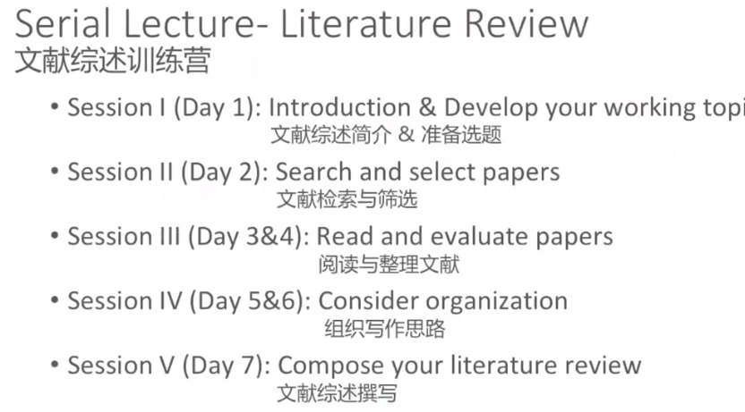

# Day1
 

## preCourse
- Structure of the course
 
 

## what's a literature review?
- definition
	- A literature review discuess what have been published on a topic by accredited scholars and researchers.

- features
	- a guiding concept
	- an organizational pattern
	- summary
		- recap of the important information of the source
	- synthesis
		- re-organization of information: new interpretation or trace the intellectual progression
	- part of introduction

- function
	- for reader
		- provide background info of topic
		- the credibility of the writer in its field
	- for writer
		- start point of beginning to do research 
		- ensures not to duplicate work already done
		- gain skills: info seeking; critical appraisal

- produce a literature review
	- develop a working topic
	- search  and select papers
	- read and evaluate papers
	- organize thoughts
	- compose it

- how to develop a right-size topic
	- clarify question: 'what'; 'so what'
	- size of the topic: 
		- span of time & space
		- size of sample and subject
		- amount of literature and sources
	- feasible of the project
		- availability of sources
		- access to sample or subject
		- time, distance, cost
	- timing
	- theory and methodology

 

## Assignment: 

- 1.develop a working topic related to air-conditioner prediction control
	- I have a certain field to research so. there is no need to drill down and narrow the scope of it.

- 2.start searching for relevant materials
	- model prediction control based on thermal dynamics
		- Model predictive control for the operation of building cooling systems
		- Model-based hierarchical optimal control design for HVAC systems
		- Energy e cient building climate control using stochastic model predictive control and weather predictions
		- Co-scheduling of HVAC control, EV charging and battery usage for building energy efficiency
	
	- data-driven prediction control
		- Autonomous HVAC Control, A Reinforcement Learning Approach
		- 

- 3.post it
